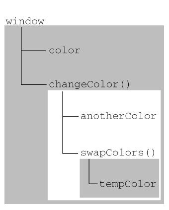

# 作用域、闭包和内存泄漏

## 作用域

### 执行环境

执行上下文（execution context），也称执行环境，定义了变量和函数有权访问的数据。环境中的所有变量和函数都保存在一个变量对象中。当某个执行环境中的代码执行完毕后，该执行环境被销毁，保存在其中的所有变量和函数定义也随之销毁。

全局执行环境是指最外围的执行环境，在Web浏览器中，就是指window对象，所有的全局对象和函数都是作为window对象的属性和方法创建的。

每个函数都有自己的执行环境，当函数执行完毕时，函数内的变量会被销毁。

例如

```javascript
function printColor(){
    var color = "blue";
    console.log(color);//blue
}
console.log(color);//报错 "ReferenceError: color is not defined
```

变量`color`在函数`printColor`中建立，当函数执行完毕时，该函数的知性环境被销毁，`color`这个变量也被销毁，因此在全局访问是访问不到的。


### 没有块作用域

**作用域**:顾名思义，就是指变量和函数的作用范围；

**块作用域**, 块作用域是指用**大括号`{}`括起来的代码**会形成一个作用域，但在JavaScript中是不存在块作用域的。

例如，在C语言中：
```c
for(int i = 1; i<5; i++){
    printf("%d",i);
}
printf("%d",i);//会报错i没有定义
```
但在JavaScript中：

```javascript
for(int i = 1; i<5; i++){
    console.log(i);
}
console.log(i);//不会报错，且会打印出来 5;
```

这是因为在C语言中，大括号`{}`括住的部分形成了自己的作用域，在其中声明的变量`i`是无法在外部访问到的。而在javascript当中，没有块作用域的概念，在大括号内声明的变量，在大括号外也是可以访问的。

### 作用域链

在JavaScript中有作用域链的概念，作用域链其实就是执行环境的栈，在标识符解析的过程中，会沿着作用域链一层一层向上找。

程序在执行过程中，没进入一个新的执行环境就会将该执行环境压入执行环境栈中，每执行完毕跳出该执行环境，就会将执行环境弹出栈。

例如，以下这段程序,程序摘自《Javascript高级程序设计》：

```javascript
var color = "blue";

function changeColor(){
    var anotherColor = "red";
    function swapColors(){
        var tempColor = anotherColor;
        anotherColor = color;
        color = tempColor;
        // 这里可以访问 color、 anotherColor 和 tempColor
    }   
    // 这里可以访问 color 和 anotherColor，但不能访问 tempColor
    swapColors();
}
// 这里只能访问 color
changeColor();
```

执行环境的压栈顺序如下：

全局作用域（`var color;function changeColor`）---->

`changeColor()`(`var anotherColor; function swapColor`)---->

`swapColor()`(`var tempColor`);

作用域链顺序如下, 摘自《Javascript高级程序设计》：



作用域链从右下角向左上角能访问的范围越来越小. swapColor中可以访问changeColor函数中的变量，反之则不可以。

>注：自己动手试一试 color、 anotherColor 和 tempColor这三个变量在哪里可以访问，哪里不可以访问吧~

## 闭包

### 什么是闭包

首先你要知道，闭包没什么神奇的，也没什么可怕的！

> **闭包**是指有权访问另一个函数作用域中的变量的函数, 创建闭包的常见形式是在一个函数内部创建并返回另一个函数。

例如:
```javascript
function get(){
    var a = 10;
    return function(){
        return a;
    }
}
var getA = get();
```

在这个例子中，返回的匿名函数就是一个闭包。

根据前面说的执行环境和作用域链，我们知道一个函数创建了一个执行上下文，函数内部的变量在函数外是访问不到的，`get`函数的`a`变量在外部是访问不到的，而闭包的作用就是使我们能够在函数外边访问到函数内部的变量，返回的匿名函数能够访问到`get`函数的内部变量`a`。

而根据作用域链知道，一个外层函数的内部函数是可以向上搜索从而访问到外层函数的变量的，就如同`get`函数中的匿名函数是可以访问到`get`函数中的变量的，因此前者就成为了后者的闭包。而这种函数嵌套是我们最常见的闭包形式。

### 闭包的作用域链

仍以`getA()`这段代码为例，当函数`get()`执行完毕时，其活动对象不会被销毁，因为匿名函数的作用域链仍在引用这个活动对象（引用为0时才可以被销毁，后面内存管理会说）。

当`get()`函数执行完毕之后，其执行环境的作用域链会被销毁，但它的活动对象仍然会留在内存中，直到匿名函数被销毁后，`get()`函数的活动对象才会被销毁。因此需要手动销毁来避免内存泄漏。

```javascript
var getA = get();
var res = getA();
getA = null;
```

>由于闭包会携带父函数的作用域，因此会比其他函数占用更多的内存，从而影响性能，因此要慎重使用闭包。

### 闭包的副作用

作用域链的这种机制导致了闭包保存的是父函数变量的**最终值**。这在出现循环的时候就会产生意想不到的结果。

```javascript
function createFunctions(){
    var result = new Array();
    for (var i=0; i < 10; i++){
        result[i] = function(){
            return i;
        };
    }
    return result;
}
```

我们希望这段代码返回一个函数数组，其中每个函数都能返回对应的索引值，但实际上由于闭包最终保存的是父函数最终的变量对象，此时的`i`值为10，因此最终返回值都为10。

解决方案如下：
```javascript
function createFunctions(){
    var result = new Array();
    for (var i=0; i < 10; i++){
        result[i] = function(num){
            return function(){
                return num; 
            };
        }(i);
    }
    return result;
}
```
在这种解决方案中，调用每个匿名函数的时候，传入变量`i`，由于函数参数是按值传递的，所以会将变量i的当前值复制给参数`num`。而在这个匿名函数内部，又创建并返回了一个访问`num`的闭包，这样一来，result数组中的每个函数都有自己的`num`变量的一个副本，因此就可以返回不同的数值了。


## 内存管理

### 垃圾回收机制

JavaScript具有自动垃圾收集机制，执行环境会负责管理内存。垃圾回收的原理是：垃圾收集器周期性定时查找不再继续使用的变量，然后释放其占用的内存。

但这个过程中，会产生一些小问题

- 性能影响 - GC 会消耗计算能力去决定什么对象应该释放
- 无法预测的停顿 - 传统 JS GC 是 stop-the-world 的回收方式（即）。现代 GC 实现尝试去避免 stop-the-world 的回收方式

以函数中的局部变量为例，当函数执行完毕，局部变量不再使用，占用的内存则会被回收。标识无用变量的策略主要有两种：标记清除、引用计数。

#### 标记清除

标记清除是最常用的垃圾回收方式。垃圾收集器会给内存中的所有变量都打上一个标记，当变量进入执行环境中时，标记为“进入环境”，离开环境时，则标记为“离开环境”可回收的状态。

#### 引用计数

引用计数回收机制不太常见。原理是跟踪记录每个值被引用的次数。当引用类型值被赋给某个变量时，这个值的引用次数就增加1，反之则减一。当这个引用类型值变为0，该值所占内存可被回收。

引用计数最大的问题是**循环引用**，循环引用是指对象A中包含一个指向对象B的指针，而对象B中也包含一个指向对象A的引用。例如：

```javascript
function problem(){
    var objectA = new Object();
    var objectB = new Object();

    objectA.someOtherObject = objectB;
    objectB.someOtherObject = objectA;
}
```

当函数执行完毕，离开执行环境时，`objectA`和`objectB`的引用计数仍然为1，因此不会被释放，也就引起了内存泄漏。

> V8引擎已经能很好的处理循环引用的情况，即循环引用的对象当没有外部引用时，会被正确的GC

#### 解除引用

为了使用最少的内存可以让页面获得更好的性能。对于大部分全局变量可以采用将其值设置为Null的方式来释放引用，例如：

```javascript
function createPerson(name){
    var localPerson = new Object();
    localPerson.name = name;
    return localPerson;
}
var globalPerson = createPerson("Nicholas");
// 手工解除 globalPerson 的引用
globalPerson = null;
```

### 闭包引起的内存泄漏

#### IE6下的内存泄漏

在IE一些低版本浏览器中（主要是IE6）由于垃圾回收机制的问题（BOM对象和DOM对象由COM对象的形式实现，而COM对象使用引用计数进行垃圾回收），存在循环引用的问题，因此会导致内存泄漏。

> Chrome 的 V8 对象实现和IE不同，此种情况下并不会内存泄漏

举个例子说明：

```javascript
window.onload = function(){
    var el = document.getElementById("id");
    el.onclick = function(){
        alert(el.id);
    }
}
```
执行给元素绑定事件时，元素绑定了匿名函数，但在匿名函数中同时又引用了元素的`id`,存在循环引用。

```javascript
window.onload = function(){
    var el = document.getElementById("id");
    var id = el.id; //解除循环引用
    el.onclick = function(){
        alert(id); 
    }
    el = null; // 将闭包引用的外部函数中活动对象清除
}
```

这种情况基本可以看做是少数浏览器的bug，跟js本身没有关系。


#### V8下的内存泄漏

> 例子来源于[这里](https://eggggger.xyz/2016/10/22/node-gc/)

```js
var theThing = null  
var replaceThing = function () {  
  var originalThing = theThing
  var unused = function () {
    if (originalThing)
      console.log("hi")
  }
  theThing = {
    longStr: new Array(1000000).join('*'),
    someMethod: function () {
      console.log(someMessage)
    }
  };
};
setInterval(replaceThing, 100)
```

上述情况中 unused 的函数中持有了 originalThing 的引用, 使得每次旧的对象不会释放从而导致内存泄漏

我们可以在 Chrome 调试工具中性能(Performance)标签页，记录内存使用情况.可以看到在这个例子在执行时，内存使用在稳步上升，即发生了内存泄漏。


