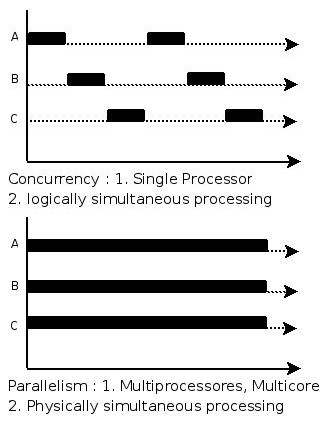
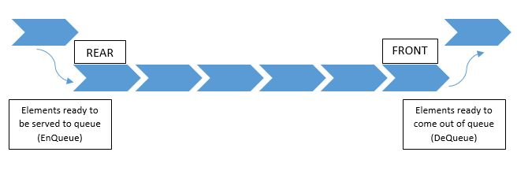
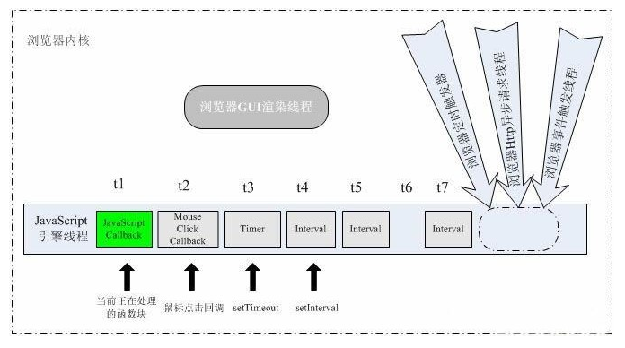
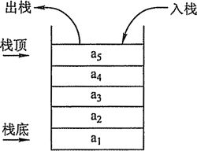

# 单线程模型和事件循环

## 定时器

首先要先讲解下定时器，js中的定时器有两种： setTimeout() 和 setInterval()

### setTimeout()

> setTimeout(code,millisec)

|  参数  | 解释           | 
|:------:|:--------------|
|code    |必需。要调用的函数后要执行的 JavaScript 代码串。|
|millisec|必需。在执行代码前需等待的毫秒数。|

return 定时器 id，可以通过 clearTimeout(id) 取消定时器任务

>注意：code可以为function或者string

setTimeout() 方法用于在指定的毫秒数后调用函数或计算表达式。

```js

var id = setTimeout(function(){
    console.log('console.log("10秒后打印")')
},10*1000)
// clearTimeout(id)
```

### setInterval()

> setInterval(code,millisec)

|  参数  | 解释           | 
|:------:|:--------------|
|code    |必需。要调用的函数后要执行的 JavaScript 代码串。|
|millisec|必需。在执行代码前需等待的毫秒数。|

return 定时器 id，可以通过 clearInterval(id) 取消定时器任务

>注意：code可以为function或者string

setInterval() 方法用于在指定的毫秒数后调用函数或计算表达式。

```js

var id = setInterval(function(){
    console.log('console.log("10秒后打印")')
},10*1000)
// clearInterval(id)
```

### 使用setTimeout()实现setInterval()

```js
function mySetInterval(fun,millisec){
    setTimeout(function(){
        fun();
        mySetInterval(fun,millisec)
    },millisec);
}
```


## 单线程模型
JavaScript是单线程的，同一时刻只能执行特定的任务。

> 进程和线程都是操作系统的概念。进程是应用程序的执行实例，每一个进程都是由私有的虚拟地址空间、代码、数据和其它系统资源所组成；进程在运行过程中能够申请创建和使用系统资源（如独立的内存区域等），这些资源也会随着进程的终止而被销毁。而线程则是进程内的一个独立执行单元，在不同的线程之间是可以共享进程资源的，所以在多线程的情况下，需要特别注意对临界资源的访问控制。在系统创建进程之后就开始启动执行进程的主线程，而进程的生命周期和这个主线程的生命周期一致，主线程的退出也就意味着进程的终止和销毁。主线程是由系统进程所创建的，同时用户也可以自主创建其它线程，这一系列的线程都会并发地运行于同一个进程中。


但是我们经常看到如下代码

```js
foo.onclick = function(e) {
    //...
};
bar.onclick = function(e) {
    //...
};
```
思考：当foo和bar被点击的时候，为什么会执行 function 里的代码？


### 从一道面试题说起

```js
var t = true;

setTimeout(function (){
    t = false;
},1000);

while (t){}

alert('end');
```

输出是什么那？不少同学会不假思索的说1s后alert('end')。其实不然，执行这行代码会一直死循环。原因是js是单线程模型，setTimeout()是通过事件循环实现的。

### 事件循环

js中使用事件循环机制，实现并发（注意不是并行）。



js的事件循环是通过队列实现的，让我先了解下什么是队列

#### 队列

栈是FIFO（先进先出）的数据结构



##### js实现

```js
names = [];
names.push("Cynthia");
names.push("Jennifer");

names.shift();

names.push("foo");
names.push("bar");

names.shift();

```

把所有的push和shift放在一起并*不影响结果*

##### js中的应用 

事件循环机制




#### 栈

栈是FILO（先进后出）的数据结构


##### js实现

```js
names = [];
names.push("Cynthia");
names.push("Jennifer");

names.pop();

names.push("foo");
names.push("bar");

names.pop();

```

push和pop调换顺序会*影响结果*

##### js中的应用 

函数调用栈

```js
function a(){
    b();
}
function b(){
    c();
}
function c(){
    //抛出异常
    throw new Error("throw this")
}
c();

```

### 定时器是准确的吗？

执行下面代码
```js
var start = new Date;
setInterval(function(){
    var end = new Date;
    console.log('Time elapsed:', end - start, 'ms');
    start = end;
}, 500);
```

打印出来的 Time elapsed 会发现不是精确的500ms，可能是499ms，也可能是501ms。

这好像看不出来js的定时器的不准确的规律。我们可以将代码改进一下，发现其规律

```js
var start = new Date;
setInterval(function(){
    var end = new Date;
    console.log('Time elapsed:', end - start, 'ms');
    
}, 500);
```

这次我们打印的是从开始执行到当前时间的总时间差，我们可以发现定时器其实总是延后触发的。和事件循环这一机制匹配

让我们再执行下一段代码
```js
var start = new Date;
var count = 0;
setInterval(function(){
    var end = new Date;
    console.log('Time elapsed:', end - start, 'ms');
    start = end;
    count++;
    if(count === 2){
        for(var i = 0; i < 1990000000; i++);
    }
}, 500);
```

这次第三次打印的 Time elapsed 有了显著变化

再换种写法试试
```js
var start = new Date;
setInterval(function(){
    var end = new Date;
    console.log('Time elapsed:', end - start, 'ms');
    start = end;
}, 500);
for(var i = 0; i < 1990000000; i++);
```

这次是第一次打印的 Time elapsed 有了显著变化


### 我们自己实现的 mySetInterval() 和系统提供的 setInterval()行为一致吗？


- id会不断改变，不利于取消
- 事件处理函数内用时过长会影响下一次定时器触发时间

大家可以自行运行下面两段代码对比其中差异

```js
var start = new Date;
setInterval(function(){
    var end = new Date;
    console.log('Time elapsed:', end - start, 'ms');
    start = end;
    for(var i = 0; i < 10000*10000; i++);
},1000)
```


```js
var start = new Date;
mySetInterval(function(){
    var end = new Date;
    console.log('Time elapsed:', end - start, 'ms');
    start = end;
    for(var i = 0; i < 10000*10000; i++);
},1000)
```