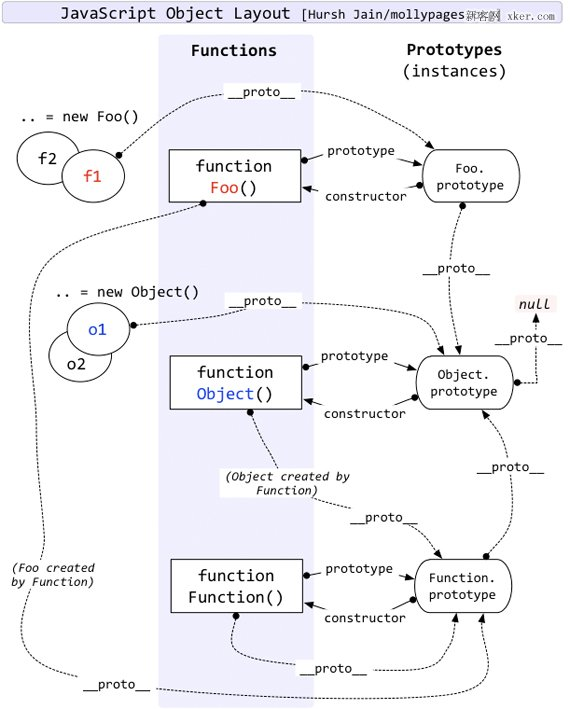

# 原型链

JavaScript 不是传统的类继承模型，而是使用 prototypal 原型模型。

其实基于原型的继承模型比传统的类继承还要强大。实现传统的类继承模型是很简单，但是实现 JavaScript 中的原型继承则要困难的多。

由于 JavaScript 是唯一一个被广泛使用的基于原型继承的语言，所以理解两种继承模式的差异是需要一定时间的，今天我们就来了解一下原型和原型链。

## `__proto__`属性

理解原型链前，我们首先需要理解`__proto__`属性。

```javascript
var obj={};
console.log(obj);
obj.__proto__.a=10;
console.log(obj.a);   // 1
```

如上代码中，我们并没有给obj.a，但是`console.log(obj.a)`却能打印出`1`。

为了解释这个现象，需要引入js查找对象属性查找的机制，我们把上面的代码稍作修改

```javascript
var obj={b:2};
console.log(obj);
obj.__proto__.a=1;
console.log(obj.a);                      // 1
console.log(obj.b);                      // 2
console.log(obj.hasOwnProperty("a"))     // false
console.log(obj.hasOwnProperty("b"))     // true
for(var i in obj) {
    console.log(i);                      // a,b
}
obj.a=3;
console.log(obj.a)                       // 3
console.log(obj.__proto__.a)             // 1
console.log(obj.__proto__.null)             // 1
```

**js属性查找首先查找自身属性，如果没有，是顺着`__proto__`不断向上查找，直到查找到`null`为止**

下面是实现的仿真代码

```javascript
findProperty(obj,property){
    if(obj.hasOwnProperty(property)){
        return obj[property];
    }
    var __proto__ = obj.__proto__;
    while(__proto__){
        if(__proto__.hasOwnProperty(property)){
            return __proto__[property]
        }
        __proto__ = __proto__.__proto__;
    }
    return undefined
}
```

### `prototype`属性

我们可以通过`prototype`实现，定义对象的成员函数。

```javascript
function Book(name,writer,price){
    this.name=name;
    this.writer=writer;
    this.price=price;
}

// 设置 Book 的 prototype 属性
Book.prototype.getRMB = function(){
    return this.price+"元";
}


var book = new Book("book1","Tom","59.9")
var book2 =  new Book("book2","jack","29.9")

// 调用成员方法
book.getRMB()

console.log(book.getRMB == book2.getRMB) // true， 所有对象共用一个 getRMB
```

如上代码之所以能成功运行，源于js在`new`做了一些魔法

我们还是以上面的Book类为例，展示`new`不为人知的一些事

```javascript
function Book(name,writer,price){
    this.name=name;
    this.writer=writer;
    this.price=price;
    return this // 不return和return this 在使用 new 的时候行为一致
}
// 设置 Book 的 prototype 属性
Book.prototype.getRMB = function(){
    return this.price+"元";
}

// var book = new Book("book1","Tom","59.9") 干的事

var book = Book.call(
    {},        // 新建一个对象
    "book1",   // 传入参数
    "Tom",
    "59.9"
    )
// 最关键一步,改变__proto__指向
book.__proto__ = Book.prototype;
```

由于`__proto__`指向改变，当我们调用`getRMB`的时候，会向上查找到`__proto__.getRMB`完成调用。

## 完整的原型图
