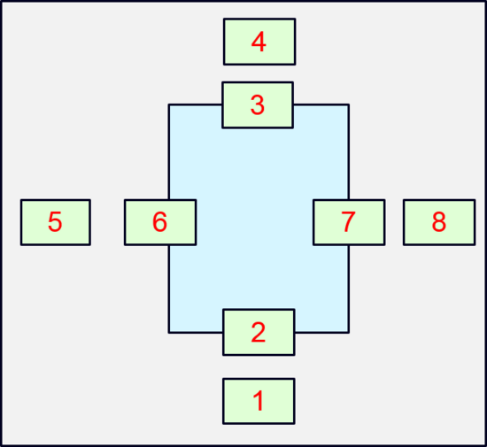

# 图片懒加载

## 什么是图片懒加载？
img元素在页面加载时并不加载实际的图片，只有当图片出现在浏览器的可视区域内时，才设置图片正真的路径，让图片显示出来。这就是图片懒加载

## 为什么要使用图片懒加载？

- 减轻服务器的压力
- 加速用户网页加载速度（用户体验好）
- 节省网络流量

经典使用场景：
- 淘宝首页
- 微信文章浏览页

## 思路

1. 没有 src 属性的 img 元素，浏览器不会发出请求下载图片，一旦通过javascript设置了图片路径，浏览器才会送请求。有点按需分配的意思，你不想看，就不给你看，你想看了就给你看~
2. 不设置 src 属性，我们怎么获取真实图片路径？我们可以使用自定义属性 data-src ,当图片进入可视区域时，将 data-src 的值设置给 src
3. 如何判断元素是否进入可视区域？我们要先了解一些基本的知识，比如说如何获取某个元素的尺寸大小、滚动条滚动距离及偏移位置距离:

    

    1. 屏幕可视窗口大小：对应于图中1、2位置处
        原生方法：
        ```javascript
        // 标准浏览器及IE9+    // 标准浏览器及低版本IE标准模式            // 低版本混杂模式
        window.innerHeight || document.documentElement.clientHeight|| document.body.clientHeight
        ```
        jQuery方法： 
        ```javascript
        $(window).height()
        ```

    2. 浏览器窗口顶部与文档顶部之间的距离，也就是滚动条滚动的距离：也就是图中3、4处对应的位置；
        原生方法：
        ```javascript
        // IE9+及标准浏览器  // 兼容ie低版本的标准模式              // 兼容混杂模式；
        window.pagYoffset|| document.documentElement.scrollTop|| document.body.scrollTop
        ```
        jQuery方法：
        ```javascript
        $(document).scrollTop();
        ```

    3. 获取元素的尺寸：对应于图中5、6位置处；左边jquery方法，右边原生方法
        ```javascript
        $(o).width()          // = o.style.width;
        $(o).innerWidth()     // = o.style.width+o.style.padding;
        $(o).outerWidth()     // = o.offsetWidth = o.style.width+o.style.padding+o.style.border;
        $(o).outerWidth(true) // = o.style.width+o.style.padding+o.style.border+o.style.margin;
        ```
    4. 获取元素的位置信息：对应与图中7、8位置处
        ```javascript
        $(o).offset().top     // 元素距离文档顶的距离
        $(o).offset().left    // 元素距离文档左边缘的距离
        ```
4. 然后就是判断元素是否进入可视区域
    
    
    外面最大的框为实际页面的大小，中间浅蓝色的框代表父元素的大小，对象1~8代表元素位于页面上的实际位置；以水平方向来做如下说明！
    - 对象8左边界相对于页面左边界的偏移距离（offsetLeft）大于父元素右边界相对于页面左边界的距离，此时可判读元素位于父元素之外；
    - 对象7左边界跨过了父元素右边界，此时：对象7左边界相对于页面左边界的偏移距离（offsetLeft）小于 父元素右边界相对于页面左边界的距离，因此对象7就进入了父元素可视区；
    - 在对象6的位置处，对象5的右边界与页面左边界的距离 大于 父元素左边界与页面左边界的距离；
    - 在对象5位置处时，对象5的右边界与页面左边界的距离 小于 父元素左边界与页面左边界的距离；此时，可判断元素处于父元素可视区外；
    - 因此水平方向必须买足两个条件，才能说明元素位于父元素的可视区内；同理垂直方向也必须满足两个条件；具体见下文的源码；
    > 对于绝大数的网页（只可以垂直滚动的），我们可以使用简化的判断方式：只判断垂直偏移

这里给出只判断垂直偏移的简单实现

```javascript
function isShow($node) {
    var windowH = $(window).height();
    var scrollTop = $(window).scrollTop();
    var nodeOT = $node.offset().top;
    var nodeH = $node.height();
    return nodeOT <= scrollTop + windowH && nodeOT + nodeH >= scrollTop
}
```

## 实现

> 注意：因为 chrome 中onscroll时间太过于频繁，我们使用 setTimeout 进行延时处理

```html
<!DOCTYPE html>
<html>
<head>
  <meta charset="utf-8">
  <meta name="viewport" content="width=device-width">
  <title>JS Bin</title>
  <style>
    .a {
      height: 1000px;
    }
    img{
      height: 394px;
      width: 650px;
      background: green;
    }
  </style>

  
</head>
<body>
  <div class="a"></div>
  <div class="a"></div>
  
  <div class="a"></div>
  <div class="a"></div>
  
  <script src="https://code.jquery.com/jquery-3.1.0.js"></script>
  <script>
    function isShow($node) {
      var windowH = $(window).height();
      var scrollTop = $(window).scrollTop();
      var nodeOT = $node.offset().top;
      var nodeH = $node.height();
      return nodeOT <= scrollTop + windowH && nodeOT + nodeH >= scrollTop
    }
    window.onscroll = function(){
      console.log(isShow($('img')))
      isShow($('img')) && $('img').src = $('img').data('src');
    }
  </script>
</body>
</html>
```
在线预览效果在[这里](http://jsbin.mafengshe.com/dax)


